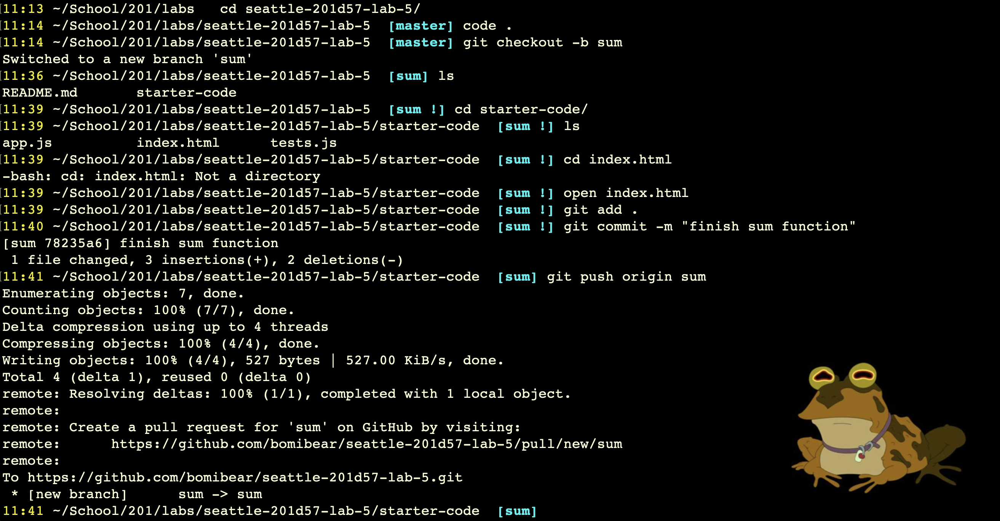
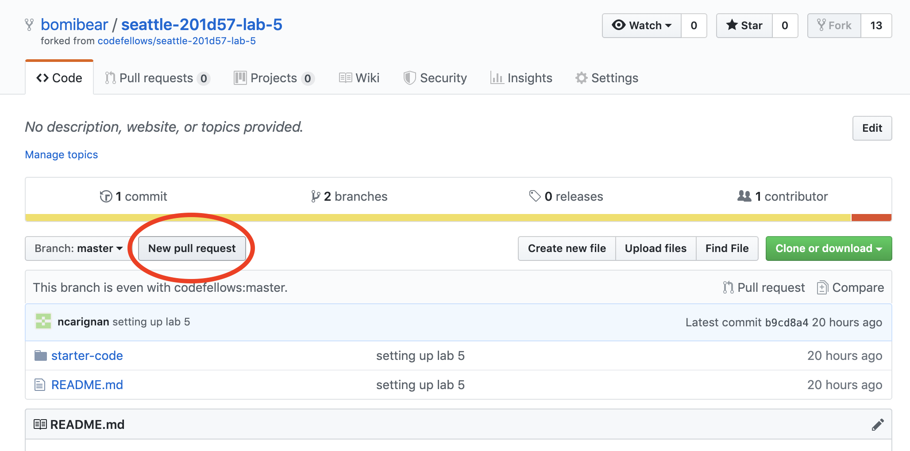
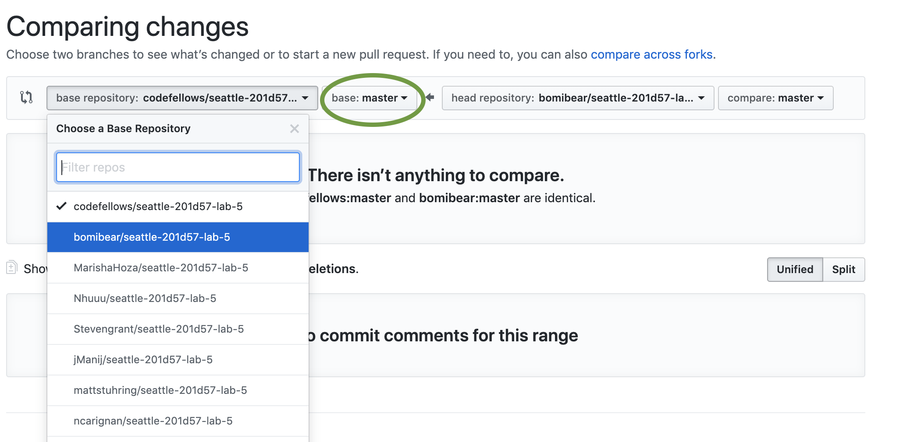
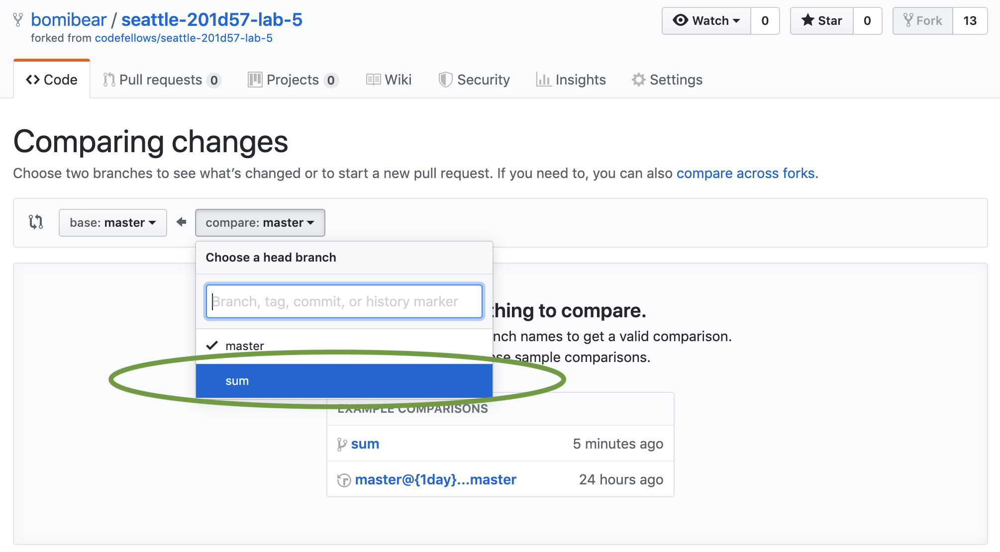
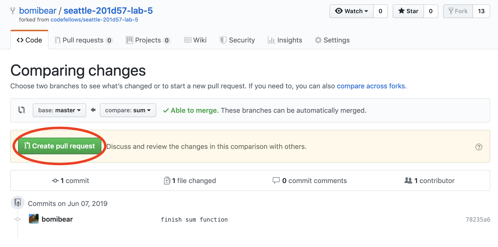
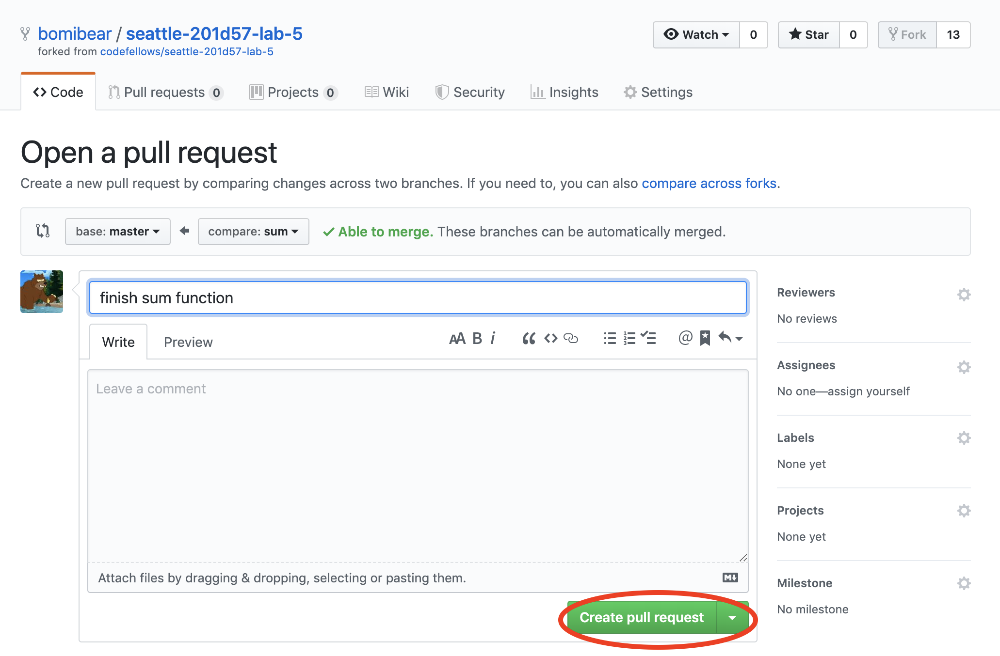
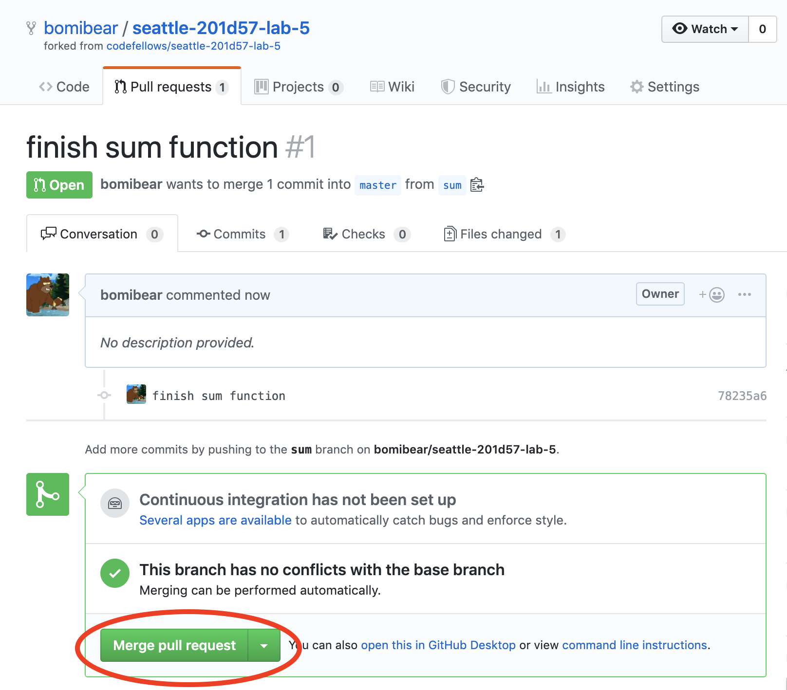
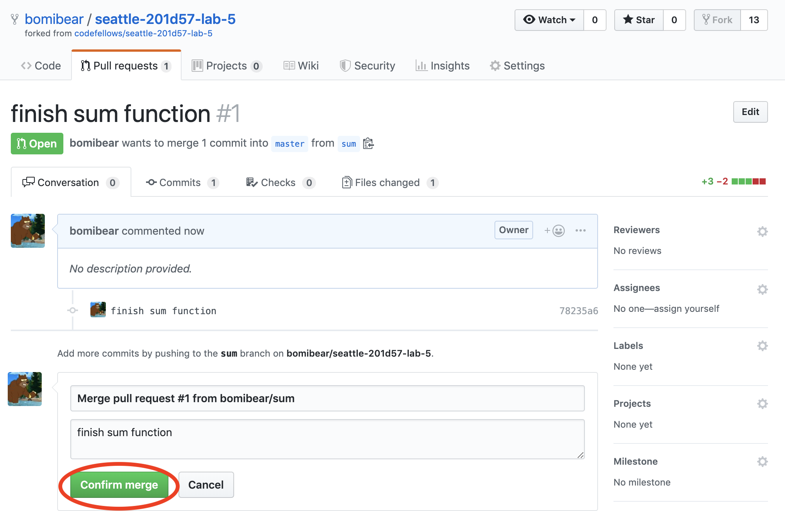
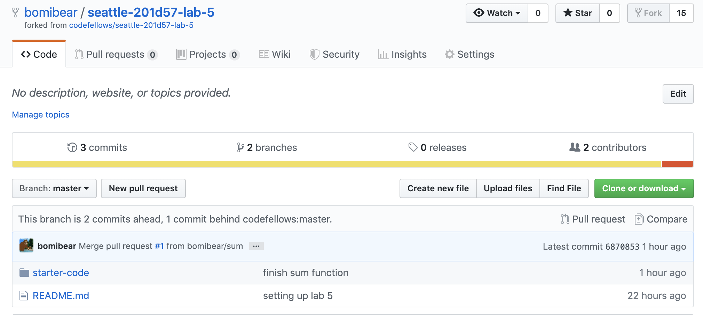

# Merging With A Forked Repo
How to merge branches with a forked repo

---
## Introduction
Lost on how to merge with a forked repo?  You've come to the right repo, friends!

## Steps

These directions assume that you have already forked a repo, have done some work on the files, and have completed an A - C - P process like this:

Now, navigate to your account on github.com:

Click the button that says "New pull request"

The next screen will allow you to change the base or head repo:

Please note that the changes from the head repo on the right is being pushed into the repo on the left, as indicated by the arrow pointing left.  If you select the original repo that you forked, the owner of that repo will get the option to whether or not to merge your changes.

Let's assume that you want to push your changes to _your_ forked version of someone else's repo.  In that case, click the drop down menu for "base repository" and select yours.

The next screen will look something like this:

The "compare" button will have a drop down menu showing all of your branches.  Select the branch with the changes you want to merge into master.

If there are no merge conflicts, the next page should look like this:

Click "Create pull request".

The next page will give you an option to open a pull request, and that will look like this:

The next page will give you an option to merge that pull request:

Click "Merge pull request".

The next page will give you an option to confirm that merge with a comment section:

If you go back to your repo landing page, it should look like this:

Don't forget to pull these changes to your local master.